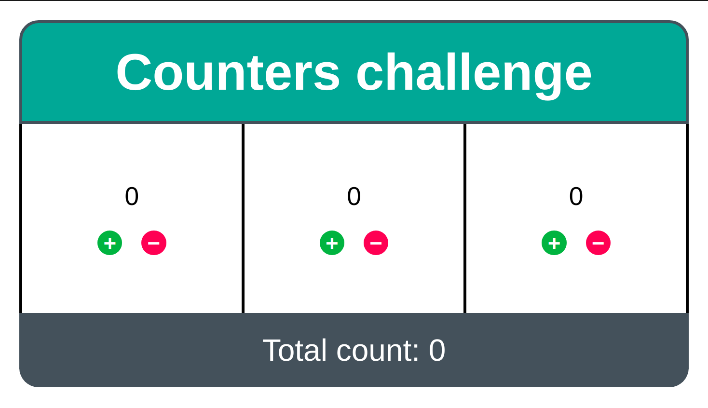

# App Counter Challenge

### Stage 1

So we're presented with the following code:

```jsx
import React from "react";

const data = [
  { id: 1, value: 0 },
  { id: 2, value: 0 },
  { id: 3, value: 0 },
];

function Counter(props) {
  const { value } = props;
  return (
    <div>
      <b>{value}</b>
      <div>
        <button>-</button>
        <button>+</button>
      </div>
    </div>
  );
}

function App() {
  return (
    <div>
      {data.map((counter) => (
        <Counter key={counter.id} value={counter.value} />
      ))}
    </div>
  );
}

export default App;
```

At the first stage our task is to add the functionality to the "plus" and "minus" buttons: increment and decrement the corresponding counter value.

There are multiple ways to manage state here:

1. Change an external object value directly (pass down the `counter` object to the `Counter` and change its `value`) and use `forceUpdate` to trigger a rerender. This approach isn't scalable and error prone. It also couples the external object with the `Counter` component thus making it very difficult to refactor and breaks the incapsulation principle.
2. Keep the `Counter` component dumb, providing it with a value and only emitting increment and decrement events from it. The `App` component would need to handle increment and decrement events and it should also handle state changes and rerenders. Thus, the `Counter` component isn't doing anything except the raw html layout. This way, the `Counter` component would be like a _controlled_ `<input type="number" />`.
3. Use an internal state in the `Counter` component (`useState` or `this.setState`) and emit a change event using a provided handler, handling change events in the `App` component. This way, the logic of incrementing and decrementing is kept inside the `Counter` component and the `App` component only needs to worry about the new state. This way, the `Counter` component is a bit smarter and works similar to an _uncontrolled_ `<input type="number" />`. Here, we would see the updated state even if the `App` component doesn't handle new state from its child components.
4. Use a _context_. React _context_ is a way to use a state anywhere in a component tree. At the top level there's a context provide which keeps track of a state and rerenders the component tree as it changes. This _context_ would also include functions to trigger the change of the state which will result in a rerender. 
5. Use a state management library (e.g. Redux or MobX). This is a layer on top of using the context directly. Such libraries have features allowing you to only rerender those components affected by the state change and organize your application logic in a separate layer.

In a simple example like this, I would use the simplest thing that works. The first approach doesn't really work as I view `forceUpdate` as a hack which defies the purpose of using React, turning it into a simple template rendering library. React is much more than that.

The second approach is good enough. But it puts a lot of pressure into the `App` component. As this is just a first stage of the application, it might be a good idea to make the `Counter` an _uncontrolled_ component. We can always make it _controlled_ later.

The fourth and fifth approachess are too complicated for such a simple task. We might never need it and lose a lot of time setting them up.

So, let's use the third approach. The `Counter` is an _uncontrolled_ component with internal state.


```javascript
import React, { useState } from "react";

const data = [
  { id: 1, value: 0 },
  { id: 2, value: 0 },
  { id: 3, value: 0 },
];

function Counter(props) {
  const { id, initialValue, onChange } = props;
  const [value, setValue] = useState(initialValue);

  const handleIncrement = () => {
    setValue(value + 1);
    onChange(id, value + 1);
  };

  const handleDecrement = () => {
    setValue(value - 1);
    onChange(id, value - 1);
  };

  return (
    <div>
      <b>{value}</b>
      <div>
        <button onClick={handleDecrement}>-</button>
        <button onClick={handleIncrement}>+</button>
      </div>
    </div>
  );
}

function App() {
  const handleCounterChange = (id, value) => {
    data.find((counter) => counter.id === id).value = value;
    console.log(data);
  };

  return (
    <div>
      {data.map((counter) => (
        <Counter
          key={counter.id}
          id={counter.id}
          initialValue={counter.value}
          onChange={handleCounterChange}
        />
      ))}
    </div>
  );
}

export default App;

```

We can also use `useCallback` for the `handleCounterChange` to optimize performance. Although, the `App` would only be rendered once as its state doesn't ever change.

Now, all the buttons work and counters display updated values. There's nothing in the requirements regarding min and max values. It might be a good idea to think about the `min` and `max` properties. Or at least prevent negative values. But it can always be added later. It's not known how the `Counter` would be used so it's better to keep it flexible. So, if there's a requirement to only have positive values, we can add the min property later and set it to `{0}` by default and override it with `{-Infinity}` or vice versa.

### Stage 2

At the second stage, the requirements has changed. Now we need to add additional number displayed which represents the sum of all counters.

So, for each call of the `handleCounterChange` we need to calculate a sum of all counters and render it on a page. There are the same 5 ways to manage this new "sum" state here. We're currently using the first way for the `data` state: changing a simple object directly. We can just add `forceUpdate` to the `handleCounterChange` and introduce a new `<b>` element to display the sum. But as I stated above, this is a hack and doesn't work in the long run.

We can't really use the second approach as the `App` is the highest level component (if you don't consider the `index.js` file.

Again, the forth and fifth approach are not worth it for this simple 2-level component tree.

So the third approach again. Now, we need to make sure that the `App` component has the state and rerenders children when the relevant parts of it change.

The question is, do we put the whole `data` object into the `App` state or just the counters' values. Of course, we can cheat again and add just the `sum` into the state and add the `recalculateSum` handler which would be called from `handleCounterChange` and result in rerendering only when the sum change. But, as our application grows, it might become possible that there are other ways to change the counters' values. So we need to put the whole application state into the `App` component state. This allows the flexibility for future requirements changes. For example, users my request the ability to rearrange the order of counters which would require rewriting the array.

So, here's how the `App` will change:


```javascript
const [counters, setCounters] = useState(data);

const handleCounterChange = useCallback((id, value)  => {
  const updatedCounters = counters.map((counter) => {
    if (counter.id === id) {
      return { ...counter, value };
    }
    return counter;
  });
  setCounters(updatedCounters);
}, [counters]);
```

Here, we tried to preserve the old counter object so that if we pass the `counter` directly as a property it will preserve its reference and prevent unnecessary rerender. This already reminds us a redux reducer. We may simplify it my splitting it into 3 `useState` calls, separating counters into 3 independent states. But what if there would be a requirement to increment all the counters at once? And what if there would be thousands of counters? It might be better for performance if we use one state.

Let's optimize the rendering. Currently, handleCounterChange is a new function each time `counters` change. And `counters` state changes each time any counter value changes. We can do so by using the `setCounters` callback variant which includes the previous state as a parameter:


```javascript
const handleCounterChange = useCallback((id, value) => {
  setCounters((prevCounters) =>
    prevCounters.map(counter => {
      if (counter.id === id) {
        return { ...counter, value };
      }
      return counter;
    })
  )
}, []);
```

The `App` component is still re-rendered two times instead of one. It happends because we're running in a `<React.StrictMode>` found in `index.js`. Let's disable it temporarily to optimize the App. Now, we can see that for each button click we rerender the `App` only once and only the `Counter` instance affected by the change.

The `id` property in the `Counter` looks a bit artificial. We don't display the counter `id` anywhere, it's not a user field. So let's move it out of the `Counter`. It's not as simple as it sounds, as we need to memoize callbacks for each counter.


```javascript
const counterChangeHandlers = useMemo(() => counters.reduce((acc, counter) => {
  acc[counter.id] = (value) => handleCounterChange(counter.id, value);
  return acc;
}, {}), counters.map((counter) => counter.id));

{counters.map((counter) => (
  <Counter
    key={counter.id}
    initialValue={counter.value}
    onChange={counterChangeHandlers[counter.id]}
  />
))}
```


```javascript
const Counter = React.memo((props) => {
  const { initialValue, onChange } = props;
  const [value, setValue] = useState(initialValue);

  const handleIncrement = () => {
    setValue(value + 1);
    onChange(value + 1);
  };

  const handleDecrement = () => {
    setValue(value - 1);
    onChange(value - 1);
  };

  return (
    <div>
      <b>{value}</b>
      <div>
        <button onClick={handleDecrement}>-</button>
        <button onClick={handleIncrement}>+</button>
      </div>
    </div>
  );
});
```

Finally, as a number of re-renders is optimal, we can add the sum of all counters as a memoized function of their values:


```javascript
const sum = useMemo(
  () => counters.reduce((acc, {value}) => acc + value, 0),
  counters.map(c => c.value)
);

<b>{sum}</b>
```

### Stage 3

Styling can be achieved using numerous ways.

1. The simplest is using inline styles (`style` property).
2. Using a `className` property along with a global css file.
3. There are CSS modules, where class names are scoped to the component instead of globally. 
4. CSS-in-JS libraries such as styled-components
5. CSS preprocessors, such as Sass, Less, Stylus

Let's use styled-components because it's more interesting than boring CSS. But the runtime costs of such a solution are quite high. And using CSS modules (or CSS preprocessors) might be preferable for high performance applications.

This is a skeleton layout and styling with logic stripped:


```javascript
const spacing = '20px';
const spacing2 = '60px';
const bold = 600;
const border = '3px';
const headingBgColor = '#00a896';
const totalBgColor = '#44515b';
const incrementBgColor = '#00b440';
const decrementBgColor = '#ff0053';


const AppContainer = styled.div`
  margin: ${spacing};
  font-family: sans-serif;
  font-size: 20pt;
`;

const Heading = styled.div`
  background-color: ${headingBgColor};
  font-size: 2em;
  font-weight: ${bold};
  text-align: center;
  color: white;
  padding: ${spacing};
  border-radius: ${spacing} ${spacing} 0 0;
  border-color: ${totalBgColor};
  border-style: solid;
  border-width: ${border};
`;

const Total = styled.div`
  background-color: ${totalBgColor};
  font-size: 1.2em;
  text-align: center;
  color: white;
  padding: ${spacing};
  border-radius: 0 0 ${spacing} ${spacing};
`;

const CountersContainer = styled.div`
  display: flex;
  flex-direction: row;
  border-style: solid;
  border-color: black;
  border-width: 0 0 0 ${border};
`;

const CounterContainer = styled.div`
  display: flex;
  flex-direction: column;
  flex: 1;
  justify-content: space-between;
  gap: ${spacing};
  text-align: center;
  padding: ${spacing2} ${spacing};
  border-style: solid;
  border-color: black;
  border-width: 0 ${border} 0 0;
`;

const CounterButtonContainer = styled.div`
  display: flex;
  justify-content: center;
  gap: ${spacing};
`;

const CounterValue = styled.div`
  font-size: 1em;
`;

const CounterButton = styled.button`
  cursor: pointer;
  padding: 0;
  border: 1px;
  border-radius: 100px;
  font-size: 0.8em;
  font-weight: ${bold};
  font-family: monospace;
  height: 1.2em;
  width: 1.2em;
`;

const IncrementButton = styled(CounterButton)`
  background-color: ${incrementBgColor};
  color: white;
`;

const DecrementButton = styled(CounterButton)`
  background-color: ${decrementBgColor};
  color: white;
`;
```

const App = () => {
  return (
    <AppContainer>
      <Heading>Counters challenge</Heading>
      <CountersContainer>
        <CounterContainer>
          <CounterValue>0</CounterValue>
          <CounterButtonContainer>
            <IncrementButton>+</IncrementButton>
            <DecrementButton>&minus;</DecrementButton>
          </CounterButtonContainer>
        </CounterContainer>
        <CounterContainer>
          <CounterValue>0</CounterValue>
          <CounterButtonContainer>
            <IncrementButton>+</IncrementButton>
            <DecrementButton>&minus;</DecrementButton>
          </CounterButtonContainer>
        </CounterContainer>
        <CounterContainer>
          <CounterValue>0</CounterValue>
          <CounterButtonContainer>
            <IncrementButton>+</IncrementButton>
            <DecrementButton>&minus;</DecrementButton>
          </CounterButtonContainer>
        </CounterContainer>
      </CountersContainer>
      <Total>Total count: 0</Total>
    </AppContainer>
  );
}

```

As a result here's a screenshot:




